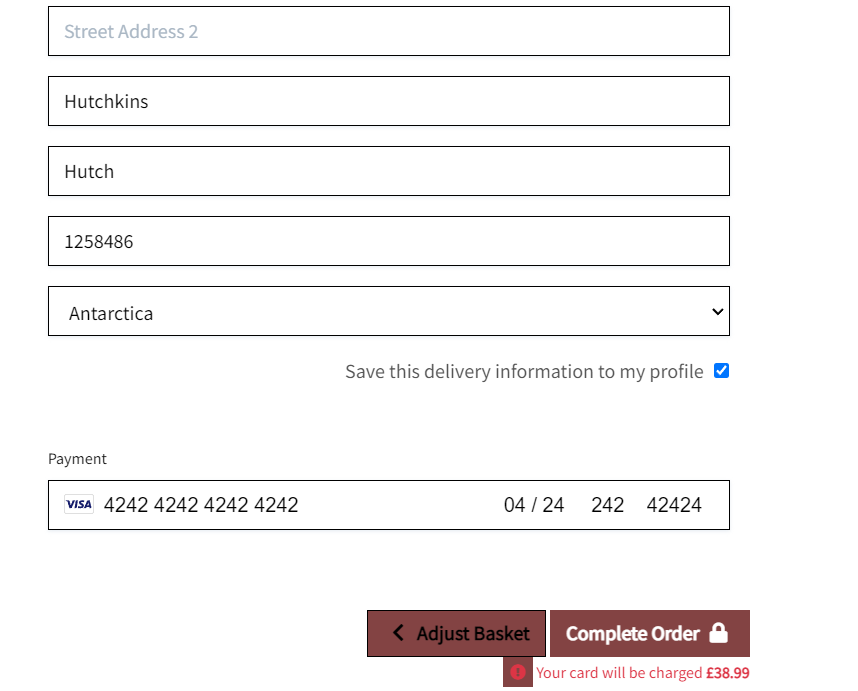

<h1 align="center">Welcome to <strong>Riss Jewels & Designs</strong></h1>

* To see my Live project on Heroku [Click here!](https://ms4-riss-jewels-and-designs.herokuapp.com/)

# About Riss Jewels & Designs

  * This website is a ecommerce based website, built for a small business as start up through sharing the client handmade products to a more vast number of customers.
  * It is a business that started at home, and still is carried out that way. 
  * All products are handmade and bespoke. 
  * Some Items are quite limited in stock due to their uniqueness of being made from certain upcycled products.
  * With this website it will be possible for the client to bring in not only more clientele as well as having an easier way to be able to sell her products.
  * Riss Jewels & Designs is a real business, but this website was built for project only purposes.

# User Experience (UX)

# Strategy

## User Stories 

### Reasons as to why a user would visit this website

* To see what Products the client makes and sells
* To see what the price range is for certain items
* Comparing prices from this bespoke products to other stores
* To see what the products look like and how they are made
* To find Resin and crystal based products

 ### Reasons for this website 
 
* To provide a wide range of products for each individual
* To be able to grow the business and reach a wider audience
* To be able to make more products available to the public
* To provide descriptions of how the products are made
 
 # Scope 

 ### What a user can expect

 * Meaningful content
 * A clean and aestethically pleasing website 
 * Easy to navigate
 * Helpful content 
 * Easy to navigate search bar
 * A good user system
 * A powerful database
 * Sense of security for payments 
 * Jewelry
 * Bespoke Products
 * Homeware
 * Ornaments
 * Acessories 

 ### What a user may be seeking

* A specific piece of Jewelry
* An Ornament or Homeware items
* Guidance or Explanation on certain stores, crystals or materials
* Price ranges
* Overall Products

 ### What I look for as a developer / business

 * Provide a useful and informative website
 * A way to be able to help a small business grow
 * To provide a way for users to be able to purchase products
 * To be able to have a good amount of users loging in and registering with the website
 * To provide product information about the different types of bespoke jewelry

 # Structure

 ### This website is made up of 5 pages
 * The homepage which consists of: 
   * A responsive navbar
   * A search bar
   * Loggin in and shopping basket icon-links
   * Four Category menu options, each with their own subcategories
   * Background image
   * A *Shop Now* button for direct link to all products page
 
 * Products page
   * Contains all products
   * Products with their images and respective descriptions and pricings
   * Edit and Delete buttons (Admin only)
   * Back to the top button

 * Shopping Basket 
  * Displays all the items added to the bag
  * Items and descriptions are displayed
  * Quantity selector
  * Size selector
  * Checkout and keep shopping buttons
  * Empty page with message if the basket is empty

* Checkout
  * Checkout for the users details, billing information and payment details
  *  If not a registered user it will be asked to sign in or register
  * Proceed to payment button or adjust basket button

* Profile 
  * User Profile with personal information (like order history and summary)
  * Updating possibility 
  * If not already a registered user, a form will be given to be able to register with the store

* Blog
  * A place for registered users to interact
  * An area where the shop owner can keep the clients updated
  * If the user is not registered, it will be prompted to log in or create an account

# Features

## Existing Features

* Navbar / Home

   * *Riss Jewels & Designs* navbar contains 4 Category links:
      * All Products
      * Jewelry
      * Homeware
      * Special Offers
    
    * Each of this 4 Categories contains a dropdown menu with different sub-categories, such as:
        * For All Products:
            * By Price
            * By Rating
            * By Category
            * All Products
        * For Jewelry:
            * Earrings
            * Necklaces
            * Bracelets
            * All Jewelry
        * For Homeware:
            * Resin Ornaments
            * Dream Catchers
            * All Homeware
        * For Special Offers:
            * New Items
            * Sale
            * Clearance 
            * All Specials

* The home page on mobile view is reduced to a single bar at the top with the burger icon in the left corner for access to the menu.

* The navbar is responsive in all devices and adjusts accordingly when in smaller to larger screens. 

* Search Bar

  * The search bar allows the user to search the database for certain products, using certain keys  
  present in the database to retrieve specific products with the inputted value.

  * The search bar is reponsive in all screens. When on smaller screens it appears next to the Profile icon with a magnifying glass icon. Making this a more tidyer approach than having a fullsized bar across the screen.

* Products Page

  * The All Products page is made of all the items existing in the store. 
  * It contains a *sort by* menu on the right corner where the user can search for a particular product in a more specific order. That being:
      * Price (Low to High) or (Hight to Low)
      * Rating (Low to High) or (Hight to Low)
      * Name (A-Z) or (Z-A)

  * In the Categories such as Jewelry, Homeware and Special Offers, a product count menu sits on the left corner so that the user is able to determine how many products are compatible with their search, thus making their purchase speedy and hassle free. 
  * Another existing feature is the buttons displaying the subcategories under the Products main title. This makes for a better User Experience if they just want to quickly browse through this categories without having to always go to the dropdown menus at the top. Also it's an efficent way of displaying which subcategories are existent in each of the main menu options.

* Product Details page

  * The product detail page, is an individual view of a single product after being clicked, where the user can read the products description, price, rating and size. 
  * This page contains a quantity selector with the option to update the quantity if the user decides that they would like more than one item of this particular product.
  * In the image, there is also the Edit / Delete buttons, which are also present but visible for Admin only.
  * Lastly at the bottom of the page, two buttons are displayed:
    * Add to Basket (which allows the user to add this item to their basket)
    * Keep Shopping (which takes the user back to the products page)

* Add a Product (Admin Only)

  * Top of the form page

  * Bottom of the form page

  * The add a product area is accessible to Admin only.
  * In this area the Admin user is able to add a new product by completing the form displayed above.
  * The form is compiled by 8 parameters:
    * Category (with a dropdown menu category selector)
    * SKU
    * Name
    * Has sizes
    * Description
    * Price 
    * Rating
    * Image Url
  * It also contain 3 buttons:
    * Select Image (letting the admin add an image of the new product and in case of no image being available, a noimage jpg will be displayed)
    * Cancel (Letting the Admin user be able to undo the form and return to the products page)
    * Add Product (Adding a new product successfully to the page and the database)

* Edit a Product (Admin Only)

  * Top of the form page

  * Bottom of the form page

* In the Editing Product page, the Admin is expected to find a form, which should be pre-filled with the current information and details about the product that is about to be edited. 

* Once the form is edited, the admin can click on Update product Button at the bottom of the page, and therefor will be returned to the this current product detail page, now displayed with the new edited information.
* In case of a change of mind, and no editing is done to this product, the admin user can simply click on the cancel button with is also located at the bottom of the page.

* Delete Product (Admin Only)

  * Deleting a product can be done so through the delete button next to the edit button on the products details page. Or in the overall product display. A small button is located under the image. 
  * This is an admin only function.
  * Deleting a product can be done so through the main page or by logging into the admin and deleting it directly from there.

* Product Review

  * In the review section the user reviews that can be viewed by all users, even if not registered
  * The Product Review section is located in the Product Details page.
  * If a user is registered and logged in, they can leave a review for the product of interest.
  * A logged in user is able to edit and update their review.

  * Product Review Main 

  * Product Review Main part 2

  * Product Review Editing/Updating

* Profile 

  * In this store the User is able to register for an account. It can do so by accessing the user menu on the top right corner of the page and clicking on the my profile icon. 
  * From there the user can Register for a new account, or if the user is a returning customer it can simply log in from there aswell.

  

  * When Registering as a new user, a form will be displayed allowing the user to create their account.
  * The form is compiled by 5 empty parameters:
    * Email Address
    * Email Address confirmation
    * Username
    * Password
    * Password confirmation
  
  * After submiting this sign up form, the user will prompt to check the email they have registered with and verify their account.
  * After verifying their account, the user will receive a message on the screen saying their account has been created successfully.

  * If an existing user, but would like to update any of their profile information, they can do so by Logging in and accessing their account.
  * The user will be prompt with a form like the one displayed underneath. 
  * After making all the intended changes, the user can safely secure their profile by clicking on the button to update their details.
  * An existing user can also look back on to their order history from their profile account.

  

* Basket

  * Pop-up preview card

  

* In the basket area the user is expected to find all the items that they have added so far through shopping on the page.
* Everytime an item is added to the basket a mini display menu is displayed in the corner of the page, showing the product that has more recently been added, along with all the other products that might already be in the basket.
* At the bottom of the small preview pop-up the user will be able to see how much their items have added up to so far, and if they have met the free delivery threshold.
* It will also display the most important information of the product such as the quantity and price.
* It will also give the option of the user to be directed to the Secure checkout page, where it will display the over all view of all shopping basket.

* When accessing the shopping basket area the user is expected to find:
  * A complete view of all the products added to the basket
  * A quantity selector to increase or decrease the number of items
  * A button to update the quantity
  * A button to remove the product if it's no longer desired
  * Product info such as (Image, sku, sizes if applicable and price)

  * Scrolling down to the bottom of the shopping basket the user is expected to find:
    * The Basket total (giving the user the total cost of items)
    * Delivery (applicable fee if not passed the £20 threshold)
    * Grand Total (which will display the total cost of all the items and any added delivery fees)
    * Secure Checkout button (Which will take the user through to the payment process)
    * Keep Shopping button (Allowing the user to return to the products page to add anymore item)

* Checkout

  * After processing through the Shopping basket, the user will be taken through to the checkout page where it will be prompt with a form to be completed with all their personal information, along with the delivery details and finally their payment details.
  * At the bottom of the page, if the user feels like there is still something else they would like to add or delete, they can easily return to the basket area by pressing the button to Adjust Basket.
  * After all the payment details, billing information and personal details have been filled, the user can now complete the order by pressing the button at the bottom of the page.
  * After the payment has through successfully the user will be greeted with their confirmation order.

* Blog

* In the Blog area, the user is expected to find a group of posts which are shown in order from most recent to the oldest.
* Each post is displayed as a card which contains a small preview of that specific articles content. A "Read more" button is provided so that the user is able to read the full post in a separate page.
* Each post contains their own detail page where the user can read the full article which will now occupy the whole screen.
* At the bottom of every post, the user is able to leave a comment in the comment section, allowing them to express their opinions and be able to discuss the post with other users.
* Registered users will also be able to delete their own posts. A delete model will be displayed to the user asking if they are certain about deleting the post.
* Articles and Comments will only be able to be posted by registered users.

## Typography for this project
  * I decided to use [Google Fonts](https://fonts.google.com/), as it is reliable and the safest font source.   I have used the Font *Great Vibes* for my project as I thought it fit quite well with the theme of the website.

## Features Left to implement
* A review model

# Technologies Used

* Technologies and Frameworks used:
    * HTML5 
    * CSS3
    * JavaScript
    * Python 
    * JQuery
    * Django
    * Bootstrap
    * Bulma
    * Git 
    * GitHub 
    * Gitpod.io 

  * Front End
    * [Google Fonts](https://fonts.google.com/)
    * [Font Awesome](https://fontawesome.com/)
  
  * Back End
    * Postgres database
    * Sqlite3 (local database)
    * [Heroku](https://www.heroku.com/)
    * AWS S3 Bucket for cloud storage.
    * Stripe for Online payment processing
    * Gmail
    * Additional packages can be found in the requirements.txt
  
  * Extras
    * [Random Key Gen](https://randomkeygen.com/)
    * [Beautifier](https://beautifier.io/)
    * [Lucid Software](https://lucid.co/) 
    * [Unsplash](https://unsplash.com/) - for background image
    * [Am I responsive](http://ami.responsivedesign.is/)
    * [TinyPNG](https://tinypng.com/)
    * [W3C HTML Validator](https://validator.w3.org/)
    * [WC3 CSS Validator](https://jigsaw.w3.org/css-validator/)
    * [JSHint](https://jshint.com/)
    * [PEP8 online](http://pep8online.com/)

# Database Schema

# Deployment 

* Requirements needed for deployment:
    * Heroku Account
    * GitHub Account

* Deploying to Heroku:

  1. Create an account with Heroku
  2. Once registered and logged in click the create new app button
  3. Once prompted select the region closest to you and give the app a name  
  4. Within the options given select and set your deployment method to 'GitHub'
  5. Connect to GitHub and login
  6. Search for the repository you wish to deploy from
  7. You will need to head to settings and click 'Config Vars'
  8. You will now need to set up your Configuration Vars the same way as you did for your env.py
  9. Your Procfile and your requirements.txt should be fully updated prior to deployment
  10. Click the deploy tab and navigate to manual deploy
  11. Select which branch you wish to deploy from and deploy the application
  12. Once the application has been deployed you will be able to view the app
  13. For an easier future deployments, set the app to automatically deploy every time you push to the repository by enabling the Automatic deploys.

* This project uses [GitHub](http://github.com/) for Storing Repositories.
* This Project uses the Django default sqlite3 database.
* This project uses Postgres database through heroku.

* For my GitHub Repo [Click here!](https://github.com/deborasantos28/ms4-riss-jewels-and-designs)

## Testing

* Please find the testing documentation here: [TESTING.md](TESTING.md)

# Credits

* Tutors at Code Institute. A huge thank you to them for helping me with any doubts or questions I had. 

* Student Care at Code Institute. A big thank you for always checking up on me and how I am doing.

* A huge Thank You to my mentor Brian Macharia for always helping me with the best tips and solutions for my projects, and always make time for me whenever I am in need of assistance.

* This project was made following the example of Code Institutes' "Boutique Ado" project.

* I've taken some inspiration from mitchdavenport88 Readme.md 

* A huge thank you to my family and friends for testing the website and give me feedback that was so valuable when making this project.
* A huge thank you mostly to my partner for letting me use her products to create her ficticious store. All her products are incredibly well made and with lots of hours of hardwork into them. I couldn't be more proud to be able to showcase her products (even if it is a ficticious purpose only).

## Contents

## Resources 

* Diagram drawing
  
  * [Lucid Software](https://lucid.co/) 

